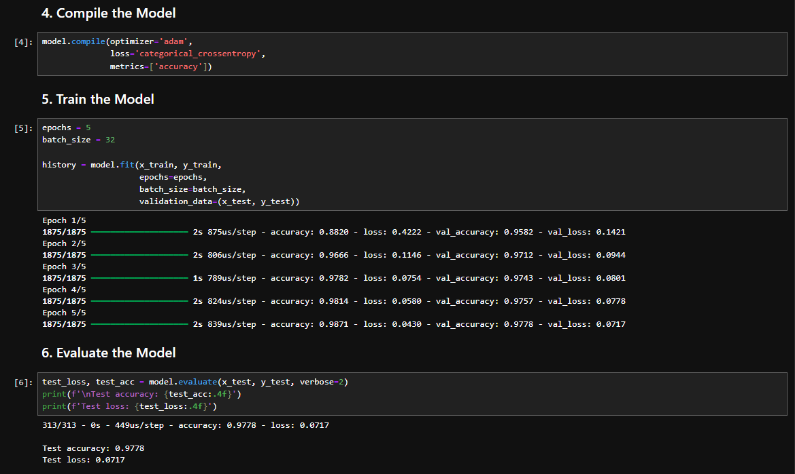

# Machine Learning Model Deployment: MNIST Digit Recognizer

This project demonstrates the deployment of a machine learning model (MNIST digit recognizer) using Python, TensorFlow/Keras for model training, and FastAPI for exposing the model via a REST API. The application is containerized using Docker.

## Features

*   **Model Training:** Jupyter notebook for training a neural network on the MNIST dataset using TensorFlow and Keras.
*   **REST API:** FastAPI application to serve predictions from the trained model.
*   **Dockerized:** Dockerfile for easy building and deployment of the application.
*   **Clean Code:** Emphasis on best practices and clear structure.



## Getting Started

### Prerequisites

*   Python 3.9 or higher
*   pip (Python package installer)
*   Docker (optional, for containerized deployment)
*   Git

### Setup

1.  **Clone the repository:**
    ```bash
    git clone <repository-url>
    cd <repository-name>
    ```

2.  **Create and activate a virtual environment:**
    ```bash
    python -m venv venv
    # On Windows
    venv\Scripts\activate
    # On macOS/Linux
    source venv/bin/activate
    ```

3.  **Install dependencies:**
    ```bash
    pip install -r requirements.txt
    ```

## Model Training

The model is trained using a Jupyter Notebook.

1.  **Navigate to the notebooks directory:**
    ```bash
    cd notebooks
    ```

2.  **Start Jupyter Notebook or JupyterLab:**
    ```bash
    jupyter notebook
    # OR
    jupyter lab
    ```
    Open `model_training.ipynb` in your browser.

3.  **Run the cells:** Execute all cells in the notebook. This will:
    *   Download the MNIST dataset.
    *   Define and compile a Keras Sequential model.
    *   Train the model.
    *   Evaluate the model's accuracy.
    *   Save the trained model to `../app/models/mnist_model.keras`.

## Running the Application

After training and saving the model, you can run the FastAPI application.

### Directly with Uvicorn (for development)

From the project root directory:
```bash
uvicorn app.main:app --reload --host 0.0.0.0 --port 8000
```
The API will be available at http://localhost:8000.

### API Endpoints

#### GET /
- **Description:** Welcome message for the API.
- **Response:**
```json
{"message": "MNIST Digit Recognizer API. Use the /predict endpoint to make predictions."}
```

#### GET /docs
- **Description:** Interactive API documentation (Swagger UI).
- **Accessible at:** http://localhost:8000/docs

#### POST /predict
- **Description:** Predicts the digit from input image data.
- **Request Body (JSON):**
```json
{
  "image_data": [0.0, ..., 0.9, ...] // Flattened 28x28 image
}
```
- **Response (JSON):**
```json
{
  "prediction": 7,
  "probabilities": [0.01, ..., 0.95, ...]
}
```

### Example: Using curl to Test /predict

#### With a dummy example:
```bash
PIXEL_DATA=$(python -c "print(str([0.0]*784).replace(' ', ''))")
curl -X POST "http://localhost:8000/predict" \
-H "Content-Type: application/json" \
-d "{"image_data": $PIXEL_DATA}"
```

## Docker Deployment

1. **Build the Docker image:**
```bash
docker build -t mnist-app .
```

2. **Run the Docker container:**
```bash
docker run -p 8000:8000 mnist-app
```

The application will be accessible at http://localhost:8000.

### Docker Management

```bash
docker ps         # List running containers
docker stop <id>  # Stop a container
docker images     # List images
docker rmi mnist-app  # Remove an image
```

## Future Enhancements

* Add input validation for pixel value ranges (0-1).
* Implement image preprocessing endpoint (e.g., resizing, normalization).
* Use a more robust method for handling model loading errors.
* Integrate CI/CD pipelines for automated testing and deployment.
* Consider using tensorflow-serving or torchserve.